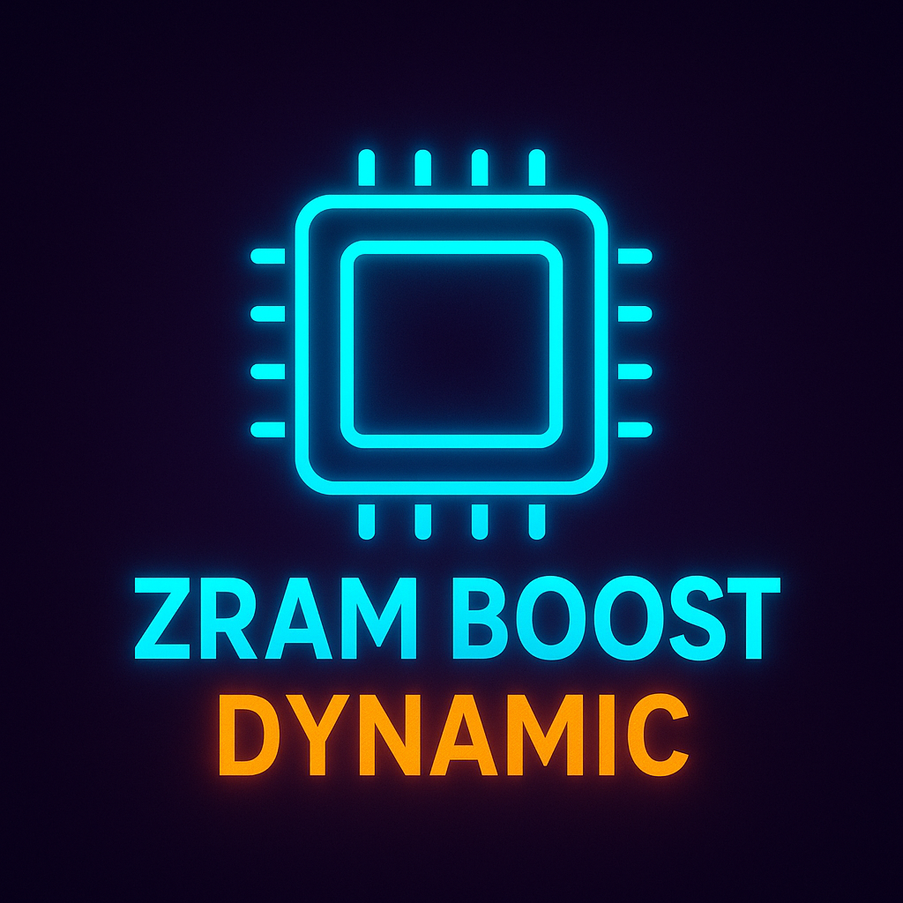

  

# ZRAM Boost Dynamic

**ZRAM Boost Dynamic** adalah modul KernelSU yang memungkinkan pengguna memilih ukuran ZRAM (0GB–10GB) secara **interaktif saat instalasi**, untuk meningkatkan performa **multitasking dan gaming** di perangkat Android.

## Fitur Utama

- **Pemilihan ZRAM dinamis saat instalasi**
  - Interval 1GB, dari 0GB sampai 10GB
  - Navigasi menggunakan Volume+ dan Volume-
  - Auto-konfirmasi dalam 10 detik jika tidak ada input
- **Konfigurasi tersimpan**
  - Ukuran ZRAM yang dipilih disimpan dalam file config (`zram_config.prop`)
  - Tidak tergantung pada `system.prop` bawaan sistem
- **Aktif otomatis saat boot**
  - `service.sh` akan membaca konfigurasi dan mengatur ulang ZRAM setiap boot

## Kelebihan

- Tidak perlu modifikasi kernel atau build ulang ROM
- Fleksibel untuk pengguna dengan kebutuhan RAM berbeda
- Optimal untuk perangkat low-end maupun flagship
- Kompatibel dengan KernelSU / Magisk

## Cara Instalasi

1. Pastikan KernelSU sudah terpasang di perangkatmu
2. Flash file ZIP [**ini**](https://github.com/UNKNUW/ZRAM-Boost-Dynamic/releases/latest) via KernelSU Manager atau recovery
3. Saat instalasi, pilih ukuran ZRAM sesuai keinginan
4. Reboot dan nikmati peningkatan performa

## **PERINGATAN**

**GUNAKAN DENGAN BIJAK!**  
• Modul ini menyentuh bagian sensitif sistem.  
Segala kerusakan, bootloop, atau ledakan ZRAM ditanggung pengguna sendiri.
• Jangan lapor ke service center, apalagi ke **POLISI**  
• Lapor saja ke Grup DEVICE masing-masing 

## Credit

- Thanks to ORIGINAL idea: @DESIRE_TM
- Modifikasi dinamis: [@unknuw](https://t.me/unknuw) x [ChatGPT](https://chat.openai.com/)
